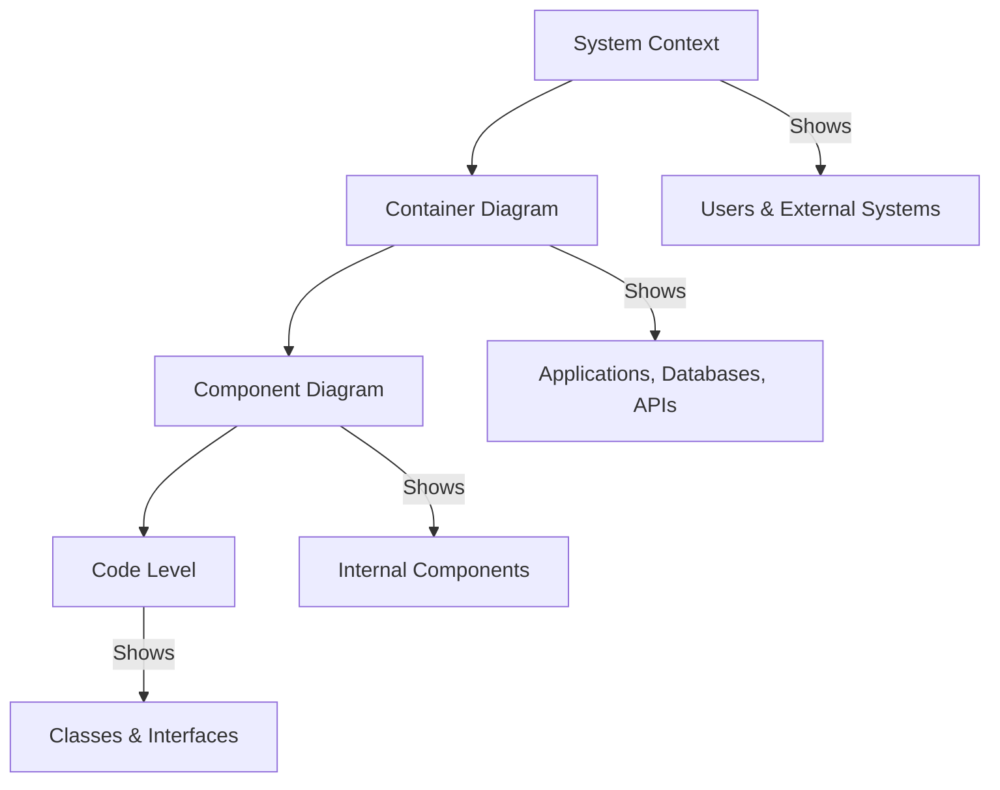

# Chapter 5: C4 Model Documentation Suite

**Last Updated:** February 5, 2026

---

## Overview

The C4 Model is a powerful approach to documenting software architecture using four levels of abstraction: Context, Containers, Components, and Code. This chapter covers the complete suite of C4 skills for creating professional architecture documentation.

### Skills Covered in This Chapter

| Skill | Source | Purpose |
|-------|--------|---------|
| `c4-context` | Unknown | System context diagrams |
| `c4-container` | Unknown | Container-level diagrams |
| `c4-component` | Unknown | Component diagrams |
| `c4-system-documentation` | Unknown | Complete C4 documentation |
| `plantuml-generator` | Unknown | Code to diagram generation |

---

## 5.1 Understanding the C4 Model

### The Four Levels

```
Level 1: Context    → System and its environment
Level 2: Container  → Applications and data stores
Level 3: Component  → Internal structure of containers
Level 4: Code       → Class diagrams (optional)
```

### C4 Diagram Hierarchy



---

## 5.2 The C4 Context Skill

> **Source**: Unknown  
> **Risk Level**: Unknown  
> **Tags**: c4, context, documentation

### Purpose

The `c4-context` skill creates Level 1 System Context diagrams showing your system's relationship with users and external systems.

### Elements at Context Level

| Element | Symbol | Description |
|---------|--------|-------------|
| **Person** | 👤 | Human users of the system |
| **Software System** | 📦 | Your system being documented |
| **External System** | 🔌 | Third-party systems you integrate with |

### 40 Copy-Paste Prompts

#### Basic Context Diagrams

```
1. "Use @c4-context to create a system context diagram for our e-commerce platform"

2. "Apply @c4-context to document the context for our CRM system"

3. "Use @c4-context to show all users and external systems for our SaaS application"

4. "Apply @c4-context to create a context diagram for the payment processing system"

5. "Use @c4-context to document the high-level architecture of our mobile app ecosystem"
```

#### User Identification

```
6. "Use @c4-context to identify all user personas for our learning management system"

7. "Apply @c4-context to map the different types of administrators in our system"

8. "Use @c4-context to document internal vs external users"

9. "Apply @c4-context to show the customer journey through our systems"

10. "Use @c4-context to identify API consumers vs web users"
```

#### External System Mapping

```
11. "Use @c4-context to map all third-party integrations"

12. "Apply @c4-context to document payment provider integrations"

13. "Use @c4-context to show authentication provider connections"

14. "Apply @c4-context to map email and notification services"

15. "Use @c4-context to document analytics and monitoring integrations"
```

#### Communication Flows

```
16. "Use @c4-context to show the primary data flows between systems"

17. "Apply @c4-context to document synchronous vs asynchronous communications"

18. "Use @c4-context to map API dependencies"

19. "Apply @c4-context to show webhook integrations"

20. "Use @c4-context to document event-driven connections"
```

#### Multi-System Contexts

```
21. "Use @c4-context to document a microservices ecosystem context"

22. "Apply @c4-context to show multi-tenant system boundaries"

23. "Use @c4-context to map a hybrid cloud architecture context"

24. "Apply @c4-context to document a multi-region deployment"

25. "Use @c4-context to show a platform with multiple product lines"
```

#### Enterprise Contexts

```
26. "Use @c4-context to document our enterprise application landscape"

27. "Apply @c4-context to show integration with legacy systems"

28. "Use @c4-context to map data flows for compliance documentation"

29. "Apply @c4-context to document the DevOps toolchain context"

30. "Use @c4-context to show security boundary contexts"
```

---

## 5.3 The C4 Container Skill

> **Source**: Unknown  
> **Risk Level**: Unknown  
> **Tags**: c4, container, documentation

### Purpose

The `c4-container` skill creates Level 2 Container diagrams showing the high-level technology choices and how containers communicate.

### Container Types

| Container Type | Examples |
|----------------|----------|
| **Web Application** | React SPA, Angular App |
| **API Application** | REST API, GraphQL Server |
| **Mobile App** | iOS App, Android App |
| **Desktop App** | Electron App |
| **Database** | PostgreSQL, MongoDB |
| **Message Broker** | RabbitMQ, Kafka |
| **File Storage** | S3, Azure Blob |
| **Cache** | Redis, Memcached |

### 40 Copy-Paste Prompts

#### Web Application Containers

```
31. "Use @c4-container to document the frontend architecture with React SPA"

32. "Apply @c4-container to show the Next.js application structure"

33. "Use @c4-container to map the microfrontend architecture"

34. "Apply @c4-container to document the static site generator containers"

35. "Use @c4-container to show the CDN and edge caching layer"
```

#### Backend Containers

```
36. "Use @c4-container to document our microservices containers"

37. "Apply @c4-container to show the API gateway and backend services"

38. "Use @c4-container to map the serverless function containers"

39. "Apply @c4-container to document the background job processors"

40. "Use @c4-container to show the authentication service container"
```

#### Data Containers

```
41. "Use @c4-container to document all database containers and their purposes"

42. "Apply @c4-container to show the read replica architecture"

43. "Use @c4-container to map the caching layer with Redis"

44. "Apply @c4-container to document the data warehouse containers"

45. "Use @c4-container to show the search index containers (Elasticsearch)"
```

#### Messaging Containers

```
46. "Use @c4-container to document the message queue architecture"

47. "Apply @c4-container to show the event streaming with Kafka"

48. "Use @c4-container to map the notification service containers"

49. "Apply @c4-container to document the pub/sub architecture"

50. "Use @c4-container to show the webhook processing containers"
```

#### Infrastructure Containers

```
51. "Use @c4-container to document the Kubernetes cluster structure"

52. "Apply @c4-container to show the container registry and CI/CD"

53. "Use @c4-container to map the monitoring and logging containers"

54. "Apply @c4-container to document the secrets management container"

55. "Use @c4-container to show the service mesh containers"
```

#### Container Communication

```
56. "Use @c4-container to map all REST API communications"

57. "Apply @c4-container to show gRPC vs REST protocol usage"

58. "Use @c4-container to document the async message flows"

59. "Apply @c4-container to show the database connection patterns"

60. "Use @c4-container to map the internal vs external APIs"
```

---

## 5.4 The C4 Component Skill

> **Source**: Unknown  
> **Risk Level**: Unknown  
> **Tags**: c4, component, documentation

### Purpose

The `c4-component` skill creates Level 3 Component diagrams showing the internal structure of containers.

### Component Types

| Component Type | Description |
|----------------|-------------|
| **Controller** | Handles HTTP requests |
| **Service** | Business logic |
| **Repository** | Data access |
| **Facade** | Simplified interface |
| **Gateway** | External system adapter |
| **Handler** | Event/message handler |

### 30 Copy-Paste Prompts

#### Service Components

```
61. "Use @c4-component to document the internal components of the User Service"

62. "Apply @c4-component to show the Order Service component structure"

63. "Use @c4-component to map the Payment Service components"

64. "Apply @c4-component to document the Notification Service internals"

65. "Use @c4-component to show the Search Service components"
```

#### API Components

```
66. "Use @c4-component to document the API layer components"

67. "Apply @c4-component to show the authentication and authorization components"

68. "Use @c4-component to map the request validation components"

69. "Apply @c4-component to document the response handling components"

70. "Use @c4-component to show the rate limiting components"
```

#### Data Access Components

```
71. "Use @c4-component to document the repository layer components"

72. "Apply @c4-component to show the ORM and query builder components"

73. "Use @c4-component to map the caching components"

74. "Apply @c4-component to document the transaction management components"

75. "Use @c4-component to show the data migration components"
```

#### Integration Components

```
76. "Use @c4-component to document the external API gateway components"

77. "Apply @c4-component to show the webhook handler components"

78. "Use @c4-component to map the event publisher components"

79. "Apply @c4-component to document the file processing components"

80. "Use @c4-component to show the third-party adapter components"
```

---

## 5.5 PlantUML Diagram Generation

> **Source**: Unknown  
> **Risk Level**: Unknown  
> **Tags**: plantuml, diagrams, visualization

### Purpose

The `plantuml-generator` skill converts code and architecture descriptions into PlantUML diagrams.

### PlantUML Syntax for C4

```plantuml
@startuml C4_Context
!include https://raw.githubusercontent.com/plantuml-stdlib/C4-PlantUML/master/C4_Context.puml

Person(user, "Customer", "A customer of the bank")
System(system, "Banking System", "Allows customers to manage accounts")
System_Ext(email, "Email System", "Microsoft Exchange")

Rel(user, system, "Uses")
Rel(system, email, "Sends emails", "SMTP")
@enduml
```

### 20 Copy-Paste Prompts

```
81. "Use @plantuml-generator to create a C4 context diagram from this description"

82. "Apply @plantuml-generator to generate a sequence diagram for the login flow"

83. "Use @plantuml-generator to create a class diagram from this Python code"

84. "Apply @plantuml-generator to generate an ERD from the database schema"

85. "Use @plantuml-generator to create a state diagram for order status"

86. "Apply @plantuml-generator to generate an activity diagram for the checkout process"

87. "Use @plantuml-generator to create a deployment diagram"

88. "Apply @plantuml-generator to generate a use case diagram"

89. "Use @plantuml-generator to create a component diagram from the codebase"

90. "Apply @plantuml-generator to generate a timing diagram for API latencies"
```

---

## 5.6 Complete System Documentation

> **Source**: Unknown  
> **Risk Level**: Unknown  
> **Tags**: documentation, complete, c4

### Purpose

The `c4-system-documentation` skill creates comprehensive documentation combining all C4 levels with additional context.

### Documentation Structure

```markdown
# System Name - Architecture Documentation

## 1. Introduction
### 1.1 Purpose
### 1.2 Scope
### 1.3 Audience

## 2. System Context (Level 1)
### 2.1 Context Diagram
### 2.2 User Personas
### 2.3 External Systems

## 3. Containers (Level 2)
### 3.1 Container Diagram
### 3.2 Container Descriptions
### 3.3 Technology Choices

## 4. Components (Level 3)
### 4.1 [Service A] Components
### 4.2 [Service B] Components

## 5. Deployment
### 5.1 Infrastructure Diagram
### 5.2 Deployment Process

## 6. Architecture Decisions
### 6.1 ADR Index
```

### 10 Copy-Paste Prompts

```
91. "Use @c4-system-documentation to create complete architecture docs for our platform"

92. "Apply @c4-system-documentation to generate a documentation template"

93. "Use @c4-system-documentation to update our existing architecture docs"

94. "Apply @c4-system-documentation to create onboarding documentation"

95. "Use @c4-system-documentation to generate compliance-ready architecture docs"

96. "Apply @c4-system-documentation to create stakeholder presentation materials"

97. "Use @c4-system-documentation to document the migration architecture"

98. "Apply @c4-system-documentation to create disaster recovery documentation"

99. "Use @c4-system-documentation to generate API architecture documentation"

100. "Apply @c4-system-documentation to create security architecture documentation"
```

---

## C4 Diagram Templates

### Context Diagram Template (PlantUML)

```plantuml
@startuml C4_Context_Template
!include https://raw.githubusercontent.com/plantuml-stdlib/C4-PlantUML/master/C4_Context.puml

LAYOUT_WITH_LEGEND()

title System Context Diagram - [System Name]

Person(customer, "Customer", "Description of customer")
Person(admin, "Administrator", "Description of admin")

System(system, "System Name", "System description")

System_Ext(ext1, "External System 1", "Description")
System_Ext(ext2, "External System 2", "Description")

Rel(customer, system, "Uses", "HTTPS")
Rel(admin, system, "Manages", "HTTPS")
Rel(system, ext1, "Integrates with", "API")
Rel(system, ext2, "Sends data to", "Webhook")

@enduml
```

### Container Diagram Template (PlantUML)

```plantuml
@startuml C4_Container_Template
!include https://raw.githubusercontent.com/plantuml-stdlib/C4-PlantUML/master/C4_Container.puml

LAYOUT_WITH_LEGEND()

title Container Diagram - [System Name]

Person(user, "User", "Description")

System_Boundary(system, "System Name") {
    Container(web, "Web Application", "React", "Frontend SPA")
    Container(api, "API Application", "Node.js", "REST API")
    ContainerDb(db, "Database", "PostgreSQL", "User data")
    Container(cache, "Cache", "Redis", "Session storage")
}

Rel(user, web, "Uses", "HTTPS")
Rel(web, api, "Calls", "REST/JSON")
Rel(api, db, "Reads/Writes", "SQL")
Rel(api, cache, "Caches", "Redis Protocol")

@enduml
```

### Component Diagram Template (PlantUML)

```plantuml
@startuml C4_Component_Template
!include https://raw.githubusercontent.com/plantuml-stdlib/C4-PlantUML/master/C4_Component.puml

LAYOUT_WITH_LEGEND()

title Component Diagram - [Container Name]

Container_Boundary(api, "API Application") {
    Component(controllers, "Controllers", "Express", "HTTP handlers")
    Component(services, "Services", "TypeScript", "Business logic")
    Component(repos, "Repositories", "TypeScript", "Data access")
    Component(validators, "Validators", "Zod", "Input validation")
}

ContainerDb(db, "Database", "PostgreSQL")

Rel(controllers, validators, "Uses")
Rel(controllers, services, "Uses")
Rel(services, repos, "Uses")
Rel(repos, db, "Queries")

@enduml
```

---

## Best Practices for C4 Documentation

### 1. Start at the Right Level

| Audience | Start Level |
|----------|-------------|
| Executives | Context |
| New developers | Context → Container |
| Senior developers | Container → Component |
| Architects | All levels |

### 2. Keep Diagrams Updated

- **Trigger updates on**: Major architectural changes, new integrations, removed components
- **Review frequency**: Quarterly or after major releases
- **Ownership**: Assign a documentation owner

### 3. Use Consistent Styling

- Same colors for same types
- Consistent naming conventions
- Standard templates

### 4. Add Context, Not Just Diagrams

Each diagram should include:
- Purpose statement
- Key decisions explained
- Links to relevant ADRs

---

## Reflection Points for Chapter 5

1. **How complete is your current architecture documentation?**
   - Do you have all four C4 levels?
   - Is it up to date?

2. **Who are the primary consumers of your documentation?**
   - Developers? Stakeholders? Auditors?
   - Are diagrams at the right abstraction level?

3. **How do you keep documentation in sync with code?**
   - Automated generation?
   - Review triggers?

4. **What tools do you use for architecture diagrams?**
   - PlantUML? Structurizr? Mermaid?
   - Version-controlled?

---

## Summary

This chapter covered the C4 Model documentation suite:

- **@c4-context**: System context diagrams showing users and external systems
- **@c4-container**: Container diagrams showing applications and data stores
- **@c4-component**: Component diagrams showing internal structure
- **@plantuml-generator**: Automated diagram generation
- **@c4-system-documentation**: Complete architecture documentation

**Key Takeaway**: The C4 Model provides a structured approach to architecture documentation that scales from high-level overviews to detailed component diagrams. Start with context, drill down as needed.

---

**Next Chapter**: [Chapter 6: Event-Driven & CQRS Patterns →](chapter-06-event-driven-cqrs.md)
