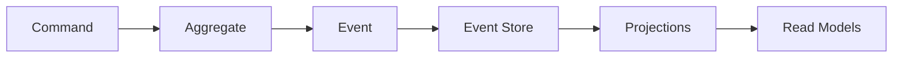
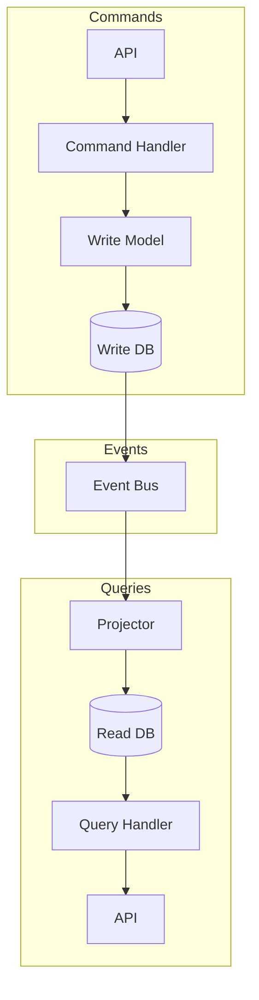

# Chapter 6: Event-Driven & CQRS Patterns

**Last Updated:** February 5, 2026

---

## Overview

Event-driven architecture and CQRS (Command Query Responsibility Segregation) are powerful patterns for building scalable, decoupled systems. This chapter covers the skills that help you design and implement these patterns effectively.

### Skills Covered in This Chapter

| Skill | Source | Purpose |
|-------|--------|---------|
| `event-sourcing-architect` | Unknown | Event sourcing patterns |
| `event-schemas` | Unknown | Event schema design |
| `cqrs-patterns` | Unknown | CQRS implementation |
| `message-queue-architect` | Unknown | Message queue design |
| `async-patterns` | Unknown | Asynchronous programming |

---

## 6.1 Event Sourcing Architecture

> **Source**: Unknown  
> **Risk Level**: Unknown  
> **Tags**: event-sourcing, architecture, patterns

### Purpose

The `event-sourcing-architect` skill provides expert guidance on designing systems where state changes are captured as a sequence of events.

### Core Concepts

| Concept | Description |
|---------|-------------|
| **Event** | Immutable record of something that happened |
| **Event Store** | Append-only log of events |
| **Aggregate** | Domain object that processes commands |
| **Projection** | Read model built from events |
| **Snapshot** | Point-in-time state for performance |

### Event Sourcing Flow



### 40 Copy-Paste Prompts

#### Event Design

```
1. "Use @event-sourcing-architect to design events for an order management system"

2. "Apply @event-sourcing-architect to create event schemas for user lifecycle"

3. "Use @event-sourcing-architect to model payment transaction events"

4. "Apply @event-sourcing-architect to design events for inventory management"

5. "Use @event-sourcing-architect to create auction bidding events"

6. "Apply @event-sourcing-architect to design shopping cart events"

7. "Use @event-sourcing-architect to model subscription lifecycle events"

8. "Apply @event-sourcing-architect to create document workflow events"

9. "Use @event-sourcing-architect to design collaboration events"

10. "Apply @event-sourcing-architect to model booking and reservation events"
```

#### Aggregate Design

```
11. "Use @event-sourcing-architect to design the Order aggregate"

12. "Apply @event-sourcing-architect to create the Account aggregate root"

13. "Use @event-sourcing-architect to model the Cart aggregate"

14. "Apply @event-sourcing-architect to design the Subscription aggregate"

15. "Use @event-sourcing-architect to create the Document aggregate"

16. "Apply @event-sourcing-architect to model the Project aggregate"

17. "Use @event-sourcing-architect to design aggregate boundaries"

18. "Apply @event-sourcing-architect to handle cross-aggregate transactions"

19. "Use @event-sourcing-architect to implement optimistic concurrency"

20. "Apply @event-sourcing-architect to design aggregate snapshotting"
```

#### Event Store Implementation

```
21. "Use @event-sourcing-architect to choose between EventStoreDB and PostgreSQL"

22. "Apply @event-sourcing-architect to design the event storage schema"

23. "Use @event-sourcing-architect to implement event versioning"

24. "Apply @event-sourcing-architect to design event stream partitioning"

25. "Use @event-sourcing-architect to implement event archival strategy"

26. "Apply @event-sourcing-architect to design event store indexing"

27. "Use @event-sourcing-architect to implement event store replication"

28. "Apply @event-sourcing-architect to design snapshot storage"

29. "Use @event-sourcing-architect to implement event compression"

30. "Apply @event-sourcing-architect to design event retention policies"
```

#### Projections

```
31. "Use @event-sourcing-architect to design read model projections"

32. "Apply @event-sourcing-architect to implement real-time projections"

33. "Use @event-sourcing-architect to design materialized views"

34. "Apply @event-sourcing-architect to handle projection rebuilding"

35. "Use @event-sourcing-architect to implement multi-stream projections"

36. "Apply @event-sourcing-architect to design search index projections"

37. "Use @event-sourcing-architect to implement analytics projections"

38. "Apply @event-sourcing-architect to design dashboard projections"

39. "Use @event-sourcing-architect to handle projection failures"

40. "Apply @event-sourcing-architect to implement projection versioning"
```

---

## 6.2 CQRS Implementation

> **Source**: Unknown  
> **Risk Level**: Unknown  
> **Tags**: cqrs, patterns, architecture

### Purpose

The `cqrs-patterns` skill provides guidance on implementing Command Query Responsibility Segregation for scalable applications.

### CQRS Architecture



### 40 Copy-Paste Prompts

#### Command Side

```
41. "Use @cqrs-patterns to design the command side for user registration"

42. "Apply @cqrs-patterns to implement command validation"

43. "Use @cqrs-patterns to create command handlers for order processing"

44. "Apply @cqrs-patterns to design idempotent commands"

45. "Use @cqrs-patterns to implement command retry logic"

46. "Apply @cqrs-patterns to design command authorization"

47. "Use @cqrs-patterns to create async command processing"

48. "Apply @cqrs-patterns to implement command logging"

49. "Use @cqrs-patterns to design command versioning"

50. "Apply @cqrs-patterns to handle command failures"
```

#### Query Side

```
51. "Use @cqrs-patterns to design optimized read models"

52. "Apply @cqrs-patterns to implement query caching"

53. "Use @cqrs-patterns to create complex query projections"

54. "Apply @cqrs-patterns to design paginated query results"

55. "Use @cqrs-patterns to implement search queries"

56. "Apply @cqrs-patterns to design aggregation queries"

57. "Use @cqrs-patterns to create real-time query updates"

58. "Apply @cqrs-patterns to implement query authorization"

59. "Use @cqrs-patterns to design denormalized read models"

60. "Apply @cqrs-patterns to handle query performance"
```

#### Synchronization

```
61. "Use @cqrs-patterns to design eventual consistency handling"

62. "Apply @cqrs-patterns to implement UI optimistic updates"

63. "Use @cqrs-patterns to handle read/write model sync"

64. "Apply @cqrs-patterns to design consistency boundaries"

65. "Use @cqrs-patterns to implement saga patterns"

66. "Apply @cqrs-patterns to handle distributed transactions"

67. "Use @cqrs-patterns to design compensation patterns"

68. "Apply @cqrs-patterns to implement the outbox pattern"

69. "Use @cqrs-patterns to handle duplicate events"

70. "Apply @cqrs-patterns to design conflict resolution"
```

---

## 6.3 Message Queue Architecture

> **Source**: Unknown  
> **Risk Level**: Unknown  
> **Tags**: messaging, queues, async

### Purpose

The `message-queue-architect` skill helps you design robust message-based communication systems.

### Message Queue Comparison

| Feature | RabbitMQ | Kafka | SQS |
|---------|----------|-------|-----|
| **Model** | Queue | Log | Queue |
| **Ordering** | Per-queue | Per-partition | Best-effort |
| **Replay** | No | Yes | No |
| **Scale** | Moderate | Massive | Managed |
| **Latency** | Low | Medium | Variable |

### 30 Copy-Paste Prompts

```
71. "Use @message-queue-architect to choose between RabbitMQ and Kafka"

72. "Apply @message-queue-architect to design the message routing topology"

73. "Use @message-queue-architect to implement dead letter queues"

74. "Apply @message-queue-architect to design message retry policies"

75. "Use @message-queue-architect to implement message ordering guarantees"

76. "Apply @message-queue-architect to design message partitioning"

77. "Use @message-queue-architect to implement message batching"

78. "Apply @message-queue-architect to design consumer groups"

79. "Use @message-queue-architect to implement backpressure handling"

80. "Apply @message-queue-architect to design message schema evolution"

81. "Use @message-queue-architect to implement priority queues"

82. "Apply @message-queue-architect to design queue monitoring"

83. "Use @message-queue-architect to implement message deduplication"

84. "Apply @message-queue-architect to design queue security"

85. "Use @message-queue-architect to implement message encryption"

86. "Apply @message-queue-architect to design multi-region messaging"

87. "Use @message-queue-architect to implement queue federation"

88. "Apply @message-queue-architect to design disaster recovery"

89. "Use @message-queue-architect to implement queue scaling"

90. "Apply @message-queue-architect to design message tracing"
```

---

## 6.4 Event Schema Design

> **Source**: Unknown  
> **Risk Level**: Unknown  
> **Tags**: events, schemas, contracts

### Purpose

The `event-schemas` skill helps design and maintain event contracts for reliable event-driven systems.

### Event Schema Template

```json
{
  "eventId": "uuid",
  "eventType": "OrderPlaced",
  "eventVersion": "1.0.0",
  "timestamp": "2026-02-05T10:00:00Z",
  "aggregateId": "order-123",
  "aggregateType": "Order",
  "correlationId": "req-456",
  "causationId": "evt-789",
  "metadata": {
    "userId": "user-123",
    "source": "web-app"
  },
  "payload": {
    "orderId": "order-123",
    "items": [],
    "total": 99.99
  }
}
```

### 10 Copy-Paste Prompts

```
91. "Use @event-schemas to design event versioning strategy"

92. "Apply @event-schemas to create backward-compatible event changes"

93. "Use @event-schemas to design event envelope structure"

94. "Apply @event-schemas to implement event validation"

95. "Use @event-schemas to create event documentation"

96. "Apply @event-schemas to design event catalog"

97. "Use @event-schemas to implement schema registry"

98. "Apply @event-schemas to design event contract testing"

99. "Use @event-schemas to handle event schema migrations"

100. "Apply @event-schemas to design event naming conventions"
```

---

## Event-Driven Anti-Patterns

### ❌ Event Overload

**Problem**: Publishing too many fine-grained events.

```
# Bad: Too granular
OrderLineItemQuantityChanged
OrderLineItemPriceChanged
OrderLineItemDiscountChanged

# Good: Meaningful business events
OrderLineItemUpdated (contains all changes)
```

### ❌ Event Sourcing Everything

**Problem**: Using event sourcing for CRUD-heavy domains.

**Solution**: Reserve event sourcing for:
- Complex business logic
- Audit requirements
- Temporal queries

### ❌ Coupling Through Events

**Problem**: Consumers depending on event internals.

**Solution**: Use published language, stable contracts, versioning.

### ❌ Missing Correlation

**Problem**: Can't trace event flows through the system.

**Solution**: Always include correlationId and causationId.

---

## Best Practices

### 1. Event Naming

```
# Past tense - something that happened
✅ OrderPlaced
✅ PaymentReceived
✅ ItemShipped

# Not commands or current state
❌ PlaceOrder
❌ OrderPlacing
❌ OrderStatus
```

### 2. Event Immutability

- Events are **immutable facts**
- Never delete or modify events
- Use compensating events for corrections

### 3. Event Versioning

```json
{
  "eventType": "OrderPlaced",
  "eventVersion": "2.0.0",
  "payload": {
    // v2 includes new fields
  }
}
```

### 4. Idempotent Consumers

```python
def handle_order_placed(event):
    # Check if already processed
    if event_repository.is_processed(event.event_id):
        return
    
    # Process event
    process_order(event)
    
    # Mark as processed
    event_repository.mark_processed(event.event_id)
```

---

## Reflection Points for Chapter 6

1. **When should you use event sourcing?**
   - Audit requirements?
   - Complex domain logic?
   - Temporal queries needed?

2. **How do you handle eventual consistency in the UI?**
   - Optimistic updates?
   - Loading states?
   - Polling vs pushing?

3. **What's your event versioning strategy?**
   - Breaking vs non-breaking changes?
   - Multiple version support?
   - Migration approach?

4. **How do you debug event-driven systems?**
   - Correlation IDs?
   - Event tracing?
   - Replaying events?

---

## Summary

This chapter covered event-driven and CQRS patterns:

- **@event-sourcing-architect**: Event sourcing design and implementation
- **@cqrs-patterns**: Command Query Responsibility Segregation
- **@message-queue-architect**: Message queue design
- **@event-schemas**: Event contract design

**Key Takeaway**: Event-driven architecture and CQRS provide powerful tools for building scalable, decoupled systems. Use them when you need audit trails, temporal queries, or massive read/write scale.

---

**Next Chapter**: [Chapter 7: Monorepo & Build System Architecture →](chapter-07-monorepo-build.md)
