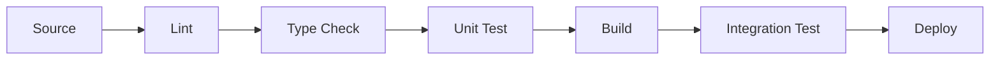

# Chapter 7: Monorepo & Build System Architecture

**Last Updated:** February 5, 2026

---

## Overview

Managing large codebases requires sophisticated approaches to code organization, dependency management, and build optimization. This chapter covers skills for designing and implementing monorepo architectures and efficient build systems.

### Skills Covered in This Chapter

| Skill | Source | Purpose |
|-------|--------|---------|
| `monorepo-architect` | Unknown | Monorepo design patterns |
| `nx-expert` | Unknown | Nx workspace management |
| `turborepo-expert` | Unknown | Turborepo optimization |
| `build-system-architect` | Unknown | Build pipeline design |
| `dependency-management` | Unknown | Dependency optimization |

---

## 7.1 Monorepo Architecture

> **Source**: Unknown  
> **Risk Level**: Unknown  
> **Tags**: monorepo, architecture, organization

### Purpose

The `monorepo-architect` skill provides expert guidance on designing and managing monorepo structures for scalable development.

### Monorepo vs Polyrepo

| Aspect | Monorepo | Polyrepo |
|--------|----------|----------|
| **Code sharing** | Easy | Challenging |
| **Consistency** | High | Variable |
| **Build complexity** | Higher | Lower per repo |
| **CI/CD** | Complex | Simple per repo |
| **Tooling** | Specialized | Standard |
| **Dependencies** | Unified | Duplicated |

### Monorepo Structure

```
my-monorepo/
├── apps/
│   ├── web/                 # Web application
│   ├── mobile/              # Mobile app
│   ├── admin/               # Admin dashboard
│   └── api/                 # Backend API
├── packages/
│   ├── ui/                  # Shared UI components
│   ├── utils/               # Shared utilities
│   ├── config/              # Shared configurations
│   └── types/               # Shared TypeScript types
├── tools/
│   ├── scripts/             # Build scripts
│   └── generators/          # Code generators
├── .github/                 # CI/CD workflows
├── nx.json                  # Nx configuration
├── turbo.json               # Turborepo config
└── package.json             # Root package.json
```

### 40 Copy-Paste Prompts

#### Structure Design

```
1. "Use @monorepo-architect to design the folder structure for our monorepo"

2. "Apply @monorepo-architect to organize apps and shared packages"

3. "Use @monorepo-architect to design package boundaries"

4. "Apply @monorepo-architect to structure a full-stack TypeScript monorepo"

5. "Use @monorepo-architect to organize a microservices monorepo"

6. "Apply @monorepo-architect to design a design system monorepo"

7. "Use @monorepo-architect to structure internal tools and packages"

8. "Apply @monorepo-architect to organize shared configurations"

9. "Use @monorepo-architect to design testing infrastructure layout"

10. "Apply @monorepo-architect to structure documentation"
```

#### Dependency Management

```
11. "Use @monorepo-architect to manage internal package dependencies"

12. "Apply @monorepo-architect to design dependency boundaries"

13. "Use @monorepo-architect to handle circular dependency prevention"

14. "Apply @monorepo-architect to optimize shared dependencies"

15. "Use @monorepo-architect to manage version synchronization"

16. "Apply @monorepo-architect to design dependency constraints"

17. "Use @monorepo-architect to handle peer dependencies in packages"

18. "Apply @monorepo-architect to design dependency graphs"

19. "Use @monorepo-architect to implement dependency linting"

20. "Apply @monorepo-architect to manage external dependency updates"
```

#### Scaling

```
21. "Use @monorepo-architect to optimize build times at scale"

22. "Apply @monorepo-architect to implement incremental builds"

23. "Use @monorepo-architect to design remote caching strategy"

24. "Apply @monorepo-architect to parallelize CI/CD workflows"

25. "Use @monorepo-architect to implement affected-only testing"

26. "Apply @monorepo-architect to design code ownership"

27. "Use @monorepo-architect to implement branch-based isolation"

28. "Apply @monorepo-architect to handle large file storage"

29. "Use @monorepo-architect to optimize git performance"

30. "Apply @monorepo-architect to implement change detection"
```

#### Migration

```
31. "Use @monorepo-architect to plan polyrepo to monorepo migration"

32. "Apply @monorepo-architect to design gradual migration strategy"

33. "Use @monorepo-architect to preserve git history during migration"

34. "Apply @monorepo-architect to handle team transition"

35. "Use @monorepo-architect to migrate CI/CD pipelines"

36. "Apply @monorepo-architect to update deployment workflows"

37. "Use @monorepo-architect to handle package registry changes"

38. "Apply @monorepo-architect to migrate documentation"

39. "Use @monorepo-architect to update developer tooling"

40. "Apply @monorepo-architect to implement rollback strategy"
```

---

## 7.2 Nx Workspace Management

> **Source**: Unknown  
> **Risk Level**: Unknown  
> **Tags**: nx, workspace, build

### Purpose

The `nx-expert` skill provides guidance on using Nx for monorepo management, including workspace configuration, generators, and build optimization.

### Nx Core Concepts

| Concept | Description |
|---------|-------------|
| **Workspace** | Root project containing all apps and libs |
| **Project** | An app or library within the workspace |
| **Target** | A task that can be run (build, test, lint) |
| **Executor** | Implementation of a target |
| **Generator** | Code scaffolding tool |
| **Cache** | Computation caching system |

### 30 Copy-Paste Prompts

#### Workspace Setup

```
41. "Use @nx-expert to initialize a new Nx workspace for React and Node"

42. "Apply @nx-expert to configure workspace with custom presets"

43. "Use @nx-expert to set up integrated vs package-based style"

44. "Apply @nx-expert to configure TypeScript paths"

45. "Use @nx-expert to set up shared ESLint and Prettier"

46. "Apply @nx-expert to configure Jest for the workspace"

47. "Use @nx-expert to set up Storybook integration"

48. "Apply @nx-expert to configure Cypress for E2E testing"

49. "Use @nx-expert to set up workspace plugins"

50. "Apply @nx-expert to configure module boundaries"
```

#### Build Optimization

```
51. "Use @nx-expert to enable distributed task execution"

52. "Apply @nx-expert to configure Nx Cloud caching"

53. "Use @nx-expert to optimize affected commands"

54. "Apply @nx-expert to configure task pipelines"

55. "Use @nx-expert to implement custom executors"

56. "Apply @nx-expert to optimize build performance"

57. "Use @nx-expert to configure parallel execution"

58. "Apply @nx-expert to implement incremental builds"

59. "Use @nx-expert to configure remote caching"

60. "Apply @nx-expert to optimize CI/CD with Nx Cloud"
```

#### Custom Generators

```
61. "Use @nx-expert to create a custom library generator"

62. "Apply @nx-expert to implement component scaffolding"

63. "Use @nx-expert to create API endpoint generator"

64. "Apply @nx-expert to implement feature module generator"

65. "Use @nx-expert to create workspace migration scripts"
```

---

## 7.3 Turborepo Optimization

> **Source**: Unknown  
> **Risk Level**: Unknown  
> **Tags**: turborepo, build, caching

### Purpose

The `turborepo-expert` skill provides guidance on using Turborepo for high-performance monorepo builds.

### turbo.json Configuration

```json
{
  "$schema": "https://turbo.build/schema.json",
  "globalDependencies": ["**/.env"],
  "pipeline": {
    "build": {
      "dependsOn": ["^build"],
      "outputs": ["dist/**", ".next/**"]
    },
    "test": {
      "dependsOn": ["build"],
      "inputs": ["src/**/*.tsx", "src/**/*.ts", "test/**/*.ts"]
    },
    "lint": {},
    "dev": {
      "cache": false,
      "persistent": true
    }
  }
}
```

### 20 Copy-Paste Prompts

```
66. "Use @turborepo-expert to configure the task pipeline"

67. "Apply @turborepo-expert to optimize caching configuration"

68. "Use @turborepo-expert to configure Vercel Remote Caching"

69. "Apply @turborepo-expert to define build dependencies"

70. "Use @turborepo-expert to optimize CI/CD with Turborepo"

71. "Apply @turborepo-expert to configure environment variables"

72. "Use @turborepo-expert to implement scoped tasks"

73. "Apply @turborepo-expert to handle workspace package dependencies"

74. "Use @turborepo-expert to configure outputs for caching"

75. "Apply @turborepo-expert to implement filtering by package"

76. "Use @turborepo-expert to configure global dependencies"

77. "Apply @turborepo-expert to optimize development experience"

78. "Use @turborepo-expert to handle persistent processes"

79. "Apply @turborepo-expert to configure input file tracking"

80. "Use @turborepo-expert to migrate from Lerna/Nx to Turborepo"
```

---

## 7.4 Build System Architecture

> **Source**: Unknown  
> **Risk Level**: Unknown  
> **Tags**: build, pipeline, optimization

### Purpose

The `build-system-architect` skill provides guidance on designing and optimizing build systems for large codebases.

### Build Pipeline Stages



### 20 Copy-Paste Prompts

```
81. "Use @build-system-architect to design the build pipeline stages"

82. "Apply @build-system-architect to optimize build parallelization"

83. "Use @build-system-architect to implement caching strategies"

84. "Apply @build-system-architect to design artifact management"

85. "Use @build-system-architect to optimize TypeScript compilation"

86. "Apply @build-system-architect to configure bundler settings"

87. "Use @build-system-architect to implement tree shaking"

88. "Apply @build-system-architect to design code splitting"

89. "Use @build-system-architect to optimize Docker builds"

90. "Apply @build-system-architect to implement multi-stage builds"

91. "Use @build-system-architect to configure source maps"

92. "Apply @build-system-architect to design asset optimization"

93. "Use @build-system-architect to implement build verification"

94. "Apply @build-system-architect to design release management"

95. "Use @build-system-architect to configure environment builds"

96. "Apply @build-system-architect to implement build metrics"

97. "Use @build-system-architect to design build notifications"

98. "Apply @build-system-architect to implement build debugging"

99. "Use @build-system-architect to configure build security"

100. "Apply @build-system-architect to implement build compliance"
```

---

## Monorepo Tool Comparison

| Feature | Nx | Turborepo | Lerna | Rush |
|---------|----|-----------| ------|------|
| **Caching** | ✅ Local + Cloud | ✅ Local + Vercel | ❌ | ✅ Local |
| **Affected** | ✅ | ✅ | ❌ | ✅ |
| **Generators** | ✅ | ❌ | ❌ | ❌ |
| **Task Graph** | ✅ | ✅ | ❌ | ✅ |
| **Learning Curve** | Medium | Low | Low | High |
| **Plugins** | ✅ Rich | ❌ | ❌ | ✅ |

---

## Best Practices

### 1. Package Boundaries

```typescript
// nx.json - enforce module boundaries
{
  "rules": {
    "@nx/enforce-module-boundaries": [
      "error",
      {
        "depConstraints": [
          { "sourceTag": "scope:shared", "onlyDependOnLibsWithTags": ["scope:shared"] },
          { "sourceTag": "scope:feature", "onlyDependOnLibsWithTags": ["scope:shared", "scope:feature"] }
        ]
      }
    ]
  }
}
```

### 2. Consistent Tooling

All packages should share:
- TypeScript version and config
- ESLint and Prettier configuration
- Testing framework and config
- Build tooling

### 3. Semantic Versioning

For publishable packages:
- Use conventional commits
- Automate changelog generation
- Coordinate breaking changes

### 4. Documentation

Each package should have:
- README with setup instructions
- API documentation
- Usage examples
- Changelog

---

## Reflection Points for Chapter 7

1. **Is a monorepo right for your organization?**
   - Team size and distribution?
   - Code sharing needs?
   - Build infrastructure?

2. **How do you manage package boundaries?**
   - Dependency constraints?
   - Code ownership?
   - Breaking changes?

3. **What's your caching strategy?**
   - Local vs remote caching?
   - Cache invalidation?
   - CI/CD integration?

4. **How do you handle scaling?**
   - Build times?
   - Git performance?
   - Developer experience?

---

## Summary

This chapter covered monorepo and build system architecture:

- **@monorepo-architect**: Monorepo design and organization
- **@nx-expert**: Nx workspace management and optimization
- **@turborepo-expert**: Turborepo build optimization
- **@build-system-architect**: Build pipeline design

**Key Takeaway**: Monorepos enable code sharing and consistency but require specialized tooling. Choose your tools based on team size, build complexity, and integration needs.

---

**Next Chapter**: [Chapter 8: Design Systems & UI Architecture →](chapter-08-design-systems.md)
