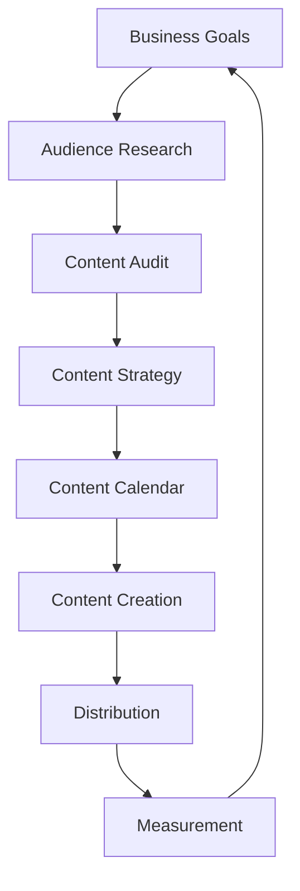

# Chapter 10: SEO & Content Marketing

**Last Updated:** February 5, 2026

---

## Overview

Search Engine Optimization and content marketing are essential for driving organic growth. This chapter covers skills that help you create SEO-optimized content, improve search rankings, and develop effective content strategies.

### Skills Covered in This Chapter

| Skill | Source | Purpose |
|-------|--------|---------|
| `@seo-expert` | coreyhaines31/marketingskills | Technical and on-page SEO |
| `@seo-fundamentals` | antigravity | SEO basics |
| `@seo-audit` | antigravity | Site audits |
| `@seo-content-writer` | antigravity | SEO content creation |
| `@seo-content-planner` | antigravity | Content planning |
| `@seo-content-auditor` | antigravity | Content audits |
| `@seo-content-refresher` | antigravity | Update old content |
| `@seo-keyword-strategist` | antigravity | Keyword strategy |
| `@seo-meta-optimizer` | antigravity | Meta optimization |
| `@seo-structure-architect` | antigravity | Site architecture |
| `@seo-authority-builder` | antigravity | Authority building |
| `@seo-cannibalization-detector` | antigravity | Detect cannibalization |
| `@seo-snippet-hunter` | antigravity | Featured snippets |
| `@programmatic-seo` | antigravity | Programmatic SEO |
| `@schema-markup` | antigravity | Structured data |
| `@content-strategist` | coreyhaines31/marketingskills | Content strategy |
| `@content-creator` | antigravity | Content creation |
| `@content-marketer` | antigravity | Content marketing |

---

## 10.1 SEO Expert Skills

> **Source**: [coreyhaines31/marketingskills](https://github.com/coreyhaines31/marketingskills)  
> **License**: MIT  
> **Tags**: seo, search, optimization

### Purpose

The `seo-expert` skill provides comprehensive guidance on technical SEO, on-page optimization, and search engine best practices.

### SEO Pillars

| Pillar | Description | Focus Areas |
|--------|-------------|-------------|
| **Technical** | Site infrastructure | Speed, crawling, indexing |
| **On-Page** | Content optimization | Keywords, meta tags, structure |
| **Off-Page** | External signals | Backlinks, social signals |
| **Content** | Quality content | E-E-A-T, user intent |

### 50 Copy-Paste Prompts

#### Technical SEO

```
1. "Use @seo-expert to audit the technical SEO of my website"

2. "Apply @seo-expert to optimize page load speed for SEO"

3. "Use @seo-expert to fix crawl errors and indexing issues"

4. "Apply @seo-expert to implement proper canonical tags"

5. "Use @seo-expert to optimize the robots.txt file"

6. "Apply @seo-expert to create an XML sitemap"

7. "Use @seo-expert to implement structured data markup"

8. "Apply @seo-expert to optimize Core Web Vitals"

9. "Use @seo-expert to fix mobile usability issues"

10. "Apply @seo-expert to implement HTTPS correctly"
```

#### On-Page Optimization

```
11. "Use @seo-expert to optimize this page's title tag and meta description"

12. "Apply @seo-expert to create an SEO-optimized heading structure"

13. "Use @seo-expert to optimize images for SEO"

14. "Apply @seo-expert to improve internal linking"

15. "Use @seo-expert to optimize URL structure"

16. "Apply @seo-expert to create SEO-friendly content"

17. "Use @seo-expert to optimize for featured snippets"

18. "Apply @seo-expert to add FAQ schema markup"

19. "Use @seo-expert to optimize for voice search"

20. "Apply @seo-expert to improve content readability for SEO"
```

#### Keyword Strategy

```
21. "Use @seo-expert to research keywords for my SaaS product"

22. "Apply @seo-expert to analyze competitor keyword rankings"

23. "Use @seo-expert to find long-tail keyword opportunities"

24. "Apply @seo-expert to create a keyword mapping strategy"

25. "Use @seo-expert to optimize for search intent"

26. "Apply @seo-expert to identify keyword cannibalization"

27. "Use @seo-expert to create keyword clusters"

28. "Apply @seo-expert to analyze keyword difficulty"

29. "Use @seo-expert to optimize for semantic keywords"

30. "Apply @seo-expert to track keyword rankings"
```

#### Local SEO

```
31. "Use @seo-expert to optimize Google Business Profile"

32. "Apply @seo-expert to create local landing pages"

33. "Use @seo-expert to build local citations"

34. "Apply @seo-expert to optimize for local pack results"

35. "Use @seo-expert to manage local reviews"

36. "Apply @seo-expert to implement local schema markup"

37. "Use @seo-expert to optimize for 'near me' searches"

38. "Apply @seo-expert to create a local link building strategy"

39. "Use @seo-expert to optimize for multiple locations"

40. "Apply @seo-expert to track local search rankings"
```

#### E-commerce SEO

```
41. "Use @seo-expert to optimize product pages for SEO"

42. "Apply @seo-expert to create SEO-friendly category pages"

43. "Use @seo-expert to implement product schema markup"

44. "Apply @seo-expert to optimize for product searches"

45. "Use @seo-expert to handle duplicate content for products"

46. "Apply @seo-expert to optimize faceted navigation"

47. "Use @seo-expert to create buying guide content"

48. "Apply @seo-expert to optimize for Google Shopping"

49. "Use @seo-expert to improve product page conversions"

50. "Apply @seo-expert to optimize user-generated reviews"
```

---

## 10.2 Content Strategy

> **Source**: [coreyhaines31/marketingskills](https://github.com/coreyhaines31/marketingskills)  
> **License**: MIT  
> **Tags**: content, strategy, marketing

### Purpose

The `content-strategist` skill helps develop comprehensive content strategies that drive traffic, engagement, and conversions.

### Content Strategy Framework



### 30 Copy-Paste Prompts

#### Strategy Development

```
51. "Use @content-strategist to create a content strategy for my B2B SaaS"

52. "Apply @content-strategist to define content pillars"

53. "Use @content-strategist to create audience personas for content"

54. "Apply @content-strategist to audit existing content"

55. "Use @content-strategist to identify content gaps"

56. "Apply @content-strategist to create a content calendar"

57. "Use @content-strategist to develop a blog strategy"

58. "Apply @content-strategist to plan video content strategy"

59. "Use @content-strategist to create a newsletter strategy"

60. "Apply @content-strategist to develop thought leadership content"
```

#### Content Types

```
61. "Use @content-strategist to plan a pillar-cluster content model"

62. "Apply @content-strategist to create a case study template"

63. "Use @content-strategist to plan webinar content"

64. "Apply @content-strategist to develop whitepaper strategy"

65. "Use @content-strategist to create podcast content plan"

66. "Apply @content-strategist to plan infographic content"

67. "Use @content-strategist to develop comparison content"

68. "Apply @content-strategist to create how-to guide templates"

69. "Use @content-strategist to plan listicle content"

70. "Apply @content-strategist to develop original research content"
```

#### Distribution and Promotion

```
71. "Use @content-strategist to create a content distribution plan"

72. "Apply @content-strategist to develop social media content strategy"

73. "Use @content-strategist to plan content repurposing"

74. "Apply @content-strategist to create email content strategy"

75. "Use @content-strategist to develop content syndication plan"

76. "Apply @content-strategist to plan influencer collaboration content"

77. "Use @content-strategist to create content promotion checklist"

78. "Apply @content-strategist to develop community content strategy"

79. "Use @content-strategist to plan paid content promotion"

80. "Apply @content-strategist to create content partnership strategy"
```

---

## 10.3 Link Building

> **Source**: Unknown  
> **Tags**: seo, backlinks, outreach

### Purpose

The `link-building-expert` skill provides strategies for acquiring high-quality backlinks to improve domain authority.

### Link Building Methods

| Method | Description | Difficulty |
|--------|-------------|------------|
| **Guest Posting** | Write for other sites | Medium |
| **Broken Link Building** | Replace dead links | Medium |
| **Resource Link Building** | Create linkable assets | High |
| **Digital PR** | News coverage | High |
| **Skyscraper** | Improve existing content | Medium |
| **HARO** | Expert quotes | Low |

### 20 Copy-Paste Prompts

```
81. "Use @link-building-expert to create a link building strategy"

82. "Apply @link-building-expert to find guest posting opportunities"

83. "Use @link-building-expert to identify broken link opportunities"

84. "Apply @link-building-expert to create linkable assets"

85. "Use @link-building-expert to develop a digital PR strategy"

86. "Apply @link-building-expert to write outreach email templates"

87. "Use @link-building-expert to find resource page opportunities"

88. "Apply @link-building-expert to create skyscraper content"

89. "Use @link-building-expert to find HARO opportunities"

90. "Apply @link-building-expert to analyze competitor backlinks"

91. "Use @link-building-expert to disavow toxic links"

92. "Apply @link-building-expert to build relationships for links"

93. "Use @link-building-expert to create infographic outreach"

94. "Apply @link-building-expert to develop expert roundup strategy"

95. "Use @link-building-expert to find podcast guest opportunities"

96. "Apply @link-building-expert to create data-driven content"

97. "Use @link-building-expert to build industry association links"

98. "Apply @link-building-expert to create scholarship link strategy"

99. "Use @link-building-expert to leverage testimonials for links"

100. "Apply @link-building-expert to measure link building ROI"
```

---

## SEO Technical Checklist

### On-Page Elements

```html
<!-- Title Tag (50-60 characters) -->
<title>Primary Keyword | Secondary Keyword | Brand</title>

<!-- Meta Description (150-160 characters) -->
<meta name="description" content="Compelling description with primary keyword that encourages clicks.">

<!-- Canonical URL -->
<link rel="canonical" href="https://example.com/page">

<!-- Open Graph Tags -->
<meta property="og:title" content="Page Title">
<meta property="og:description" content="Description for social sharing">
<meta property="og:image" content="https://example.com/image.jpg">

<!-- Structured Data -->
<script type="application/ld+json">
{
  "@context": "https://schema.org",
  "@type": "Article",
  "headline": "Article Title",
  "author": {"@type": "Person", "name": "Author Name"},
  "datePublished": "2026-02-05"
}
</script>
```

### Technical Requirements

```yaml
# robots.txt
User-agent: *
Allow: /
Disallow: /admin/
Disallow: /api/
Sitemap: https://example.com/sitemap.xml

# Core Web Vitals Targets
LCP: < 2.5s    # Largest Contentful Paint
FID: < 100ms   # First Input Delay
CLS: < 0.1     # Cumulative Layout Shift
```

---

## Content Calendar Template

```markdown
| Week | Topic | Format | Target Keyword | Funnel Stage |
|------|-------|--------|----------------|--------------|
| 1 | How to Use X | Blog Post | how to use X | Awareness |
| 1 | X vs Y Comparison | Blog Post | X vs Y | Consideration |
| 2 | Case Study: Company | Case Study | X software | Decision |
| 2 | Beginner's Guide to X | Pillar Page | X guide | Awareness |
| 3 | Expert Tips for X | Blog Post | X tips | Consideration |
| 3 | X Templates | Resource | X templates | Decision |
| 4 | Podcast: Industry Trends | Podcast | - | Awareness |
| 4 | Monthly Newsletter | Email | - | Retention |
```

---

## Best Practices

### 1. Search Intent Alignment

| Keyword Type | Intent | Content Format |
|--------------|--------|----------------|
| "What is X" | Informational | Educational article |
| "Best X software" | Commercial | Comparison, reviews |
| "Buy X online" | Transactional | Product page |
| "X near me" | Local | Local landing page |

### 2. E-E-A-T Signals

- **Experience**: Show first-hand experience
- **Expertise**: Demonstrate subject knowledge
- **Authoritativeness**: Build reputation
- **Trustworthiness**: Provide accurate information

### 3. Content Quality Checklist

- [ ] Answers user's question completely
- [ ] Well-structured with headings
- [ ] Includes relevant visuals
- [ ] Updated regularly
- [ ] No factual errors
- [ ] Properly sourced

---

## Reflection Points for Chapter 10

1. **How do you currently measure SEO success?**
   - Organic traffic?
   - Keyword rankings?
   - Conversions from organic?

2. **What's your content production capacity?**
   - Weekly articles?
   - Monthly pillar content?
   - Resource investments?

3. **How do you prioritize SEO opportunities?**
   - Traffic potential?
   - Conversion value?
   - Competition level?

4. **What's your competitive advantage for content?**
   - Unique data?
   - Industry expertise?
   - Brand authority?

---

## Summary

This chapter covered SEO and content marketing skills:

- **@seo-expert**: Technical and on-page SEO optimization
- **@content-strategist**: Content strategy development
- **@link-building-expert**: Backlink acquisition strategies

**Key Takeaway**: SEO success requires a combination of technical excellence, quality content, and authoritative backlinks. Focus on user intent and create content that genuinely helps your audience.

---

**Next Chapter**: [Chapter 11: Copywriting & Content Creation →](chapter-11-copywriting.md)
