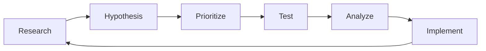

# Chapter 12: Conversion Rate Optimization (CRO)

**Last Updated:** February 5, 2026

---

## Overview

Conversion Rate Optimization is the systematic process of increasing the percentage of website visitors who take desired actions. This chapter covers skills for analyzing user behavior, running experiments, and optimizing conversion funnels.

### Skills Covered in This Chapter

| Skill | Source | Purpose |
|-------|--------|---------|
| `cro-expert` | coreyhaines31/marketingskills | Conversion optimization |
| `ab-testing-expert` | coreyhaines31/marketingskills | Experimentation |
| `analytics-expert` | Unknown | Data analysis |
| `user-research` | Unknown | User behavior insights |
| `funnel-optimization` | Unknown | Funnel analysis |

---

## 12.1 CRO Fundamentals

> **Source**: [coreyhaines31/marketingskills](https://github.com/coreyhaines31/marketingskills)  
> **License**: MIT  
> **Tags**: cro, optimization, conversion

### Purpose

The `cro-expert` skill provides a systematic approach to improving conversion rates through data-driven optimization.

### CRO Process



### Conversion Metrics

| Metric | Formula | Benchmark |
|--------|---------|-----------|
| **Conversion Rate** | Conversions / Visitors | 2-5% |
| **Bounce Rate** | Single-page / Total sessions | 40-60% |
| **Cart Abandonment** | Abandoned / Started checkout | 70% |
| **Time on Page** | Avg time spent | 2-3 min |
| **Click-Through Rate** | Clicks / Impressions | 2-3% |

### 40 Copy-Paste Prompts

#### Analysis and Research

```
1. "Use @cro-expert to audit the conversion funnel for my e-commerce site"

2. "Apply @cro-expert to analyze why my landing page has low conversion"

3. "Use @cro-expert to identify friction points in the checkout process"

4. "Apply @cro-expert to analyze user behavior on my pricing page"

5. "Use @cro-expert to create a CRO research plan"

6. "Apply @cro-expert to analyze form abandonment issues"

7. "Use @cro-expert to identify high-impact optimization opportunities"

8. "Apply @cro-expert to analyze mobile conversion issues"

9. "Use @cro-expert to review heatmap data"

10. "Apply @cro-expert to analyze session recordings"
```

#### Homepage Optimization

```
11. "Use @cro-expert to optimize homepage for conversions"

12. "Apply @cro-expert to improve above-the-fold engagement"

13. "Use @cro-expert to optimize navigation for conversions"

14. "Apply @cro-expert to improve hero section effectiveness"

15. "Use @cro-expert to optimize homepage CTAs"

16. "Apply @cro-expert to reduce homepage bounce rate"

17. "Use @cro-expert to improve social proof placement"

18. "Apply @cro-expert to optimize homepage load time"

19. "Use @cro-expert to improve homepage mobile experience"

20. "Apply @cro-expert to optimize homepage for different segments"
```

#### Product and Pricing Pages

```
21. "Use @cro-expert to optimize product page conversions"

22. "Apply @cro-expert to improve pricing page effectiveness"

23. "Use @cro-expert to design high-converting pricing tables"

24. "Apply @cro-expert to optimize product descriptions"

25. "Use @cro-expert to improve product image galleries"

26. "Apply @cro-expert to optimize product reviews display"

27. "Use @cro-expert to improve add-to-cart conversions"

28. "Apply @cro-expert to optimize cross-sell recommendations"

29. "Use @cro-expert to improve urgency elements"

30. "Apply @cro-expert to optimize out-of-stock handling"
```

#### Forms and Checkout

```
31. "Use @cro-expert to optimize signup form conversions"

32. "Apply @cro-expert to reduce checkout abandonment"

33. "Use @cro-expert to optimize multi-step forms"

34. "Apply @cro-expert to improve form field design"

35. "Use @cro-expert to optimize form validation messaging"

36. "Apply @cro-expert to reduce form friction"

37. "Use @cro-expert to optimize guest checkout"

38. "Apply @cro-expert to improve payment form design"

39. "Use @cro-expert to optimize shipping options presentation"

40. "Apply @cro-expert to improve order confirmation page"
```

---

## 12.2 A/B Testing

> **Source**: [coreyhaines31/marketingskills](https://github.com/coreyhaines31/marketingskills)  
> **License**: MIT  
> **Tags**: testing, experimentation, optimization

### Purpose

The `ab-testing-expert` skill provides guidance on running statistically valid experiments.

### Test Types

| Type | Description | Use Case |
|------|-------------|----------|
| **A/B Test** | Two variants | Simple changes |
| **A/B/n Test** | Multiple variants | Comparing options |
| **Multivariate** | Multiple variables | Complex pages |
| **Split Test** | Different URLs | Major redesigns |
| **Bandit** | Dynamic allocation | Fast optimization |

### 30 Copy-Paste Prompts

#### Test Planning

```
41. "Use @ab-testing-expert to create a hypothesis for this test"

42. "Apply @ab-testing-expert to calculate required sample size"

43. "Use @ab-testing-expert to determine test duration"

44. "Apply @ab-testing-expert to define success metrics"

45. "Use @ab-testing-expert to create a test plan document"

46. "Apply @ab-testing-expert to prioritize test ideas using ICE"

47. "Use @ab-testing-expert to design test variants"

48. "Apply @ab-testing-expert to identify test segments"

49. "Use @ab-testing-expert to plan multivariate test"

50. "Apply @ab-testing-expert to create a testing roadmap"
```

#### Analysis and Reporting

```
51. "Use @ab-testing-expert to analyze test results"

52. "Apply @ab-testing-expert to determine statistical significance"

53. "Use @ab-testing-expert to identify segment differences"

54. "Apply @ab-testing-expert to calculate revenue impact"

55. "Use @ab-testing-expert to create test report template"

56. "Apply @ab-testing-expert to analyze inconclusive results"

57. "Use @ab-testing-expert to identify learnings from failed tests"

58. "Apply @ab-testing-expert to document test insights"

59. "Use @ab-testing-expert to calculate lift and confidence"

60. "Apply @ab-testing-expert to plan follow-up tests"
```

#### Common Tests

```
61. "Use @ab-testing-expert to test headline variations"

62. "Apply @ab-testing-expert to test CTA button colors"

63. "Use @ab-testing-expert to test pricing display formats"

64. "Apply @ab-testing-expert to test form length"

65. "Use @ab-testing-expert to test social proof placement"

66. "Apply @ab-testing-expert to test image vs video"

67. "Use @ab-testing-expert to test navigation layout"

68. "Apply @ab-testing-expert to test checkout steps"

69. "Use @ab-testing-expert to test urgency messaging"

70. "Apply @ab-testing-expert to test personalization"
```

---

## 12.3 Funnel Optimization

> **Source**: Unknown  
> **Tags**: funnel, optimization, analytics

### Purpose

The `funnel-optimization` skill helps analyze and optimize conversion funnels.

### Typical E-commerce Funnel

```
Landing Page    (100%) ───────────────────────────
        │
        ▼ (70% proceed)
Product Page    (70%)  ────────────────────────
        │
        ▼ (30% add to cart)
Cart            (21%)  ──────────────────
        │
        ▼ (60% proceed)
Checkout        (12.6%) ─────────────
        │
        ▼ (70% complete)
Thank You       (8.8%) ──────────
```

### 15 Copy-Paste Prompts

```
71. "Use @funnel-optimization to analyze our acquisition funnel"

72. "Apply @funnel-optimization to identify the biggest drop-off point"

73. "Use @funnel-optimization to optimize top-of-funnel conversions"

74. "Apply @funnel-optimization to improve mid-funnel engagement"

75. "Use @funnel-optimization to reduce bottom-funnel abandonment"

76. "Apply @funnel-optimization to create micro-conversion goals"

77. "Use @funnel-optimization to design an onboarding funnel"

78. "Apply @funnel-optimization to optimize SaaS trial funnel"

79. "Use @funnel-optimization to improve webinar registration funnel"

80. "Apply @funnel-optimization to analyze mobile vs desktop funnels"

81. "Use @funnel-optimization to optimize email conversion funnel"

82. "Apply @funnel-optimization to design lead nurturing funnel"

83. "Use @funnel-optimization to create re-engagement funnel"

84. "Apply @funnel-optimization to analyze segment-specific funnels"

85. "Use @funnel-optimization to optimize upsell funnel"
```

---

## 12.4 User Research for CRO

> **Source**: Unknown  
> **Tags**: research, user, qualitative

### Purpose

The `user-research` skill provides methods for understanding user behavior and motivations.

### Research Methods

| Method | Type | Best For |
|--------|------|----------|
| **Surveys** | Quantitative | Broad feedback |
| **Interviews** | Qualitative | Deep insights |
| **Usability Testing** | Qualitative | UX issues |
| **Session Recording** | Behavioral | Friction points |
| **Heatmaps** | Behavioral | Engagement patterns |
| **Exit Surveys** | Quantitative | Abandonment reasons |

### 15 Copy-Paste Prompts

```
86. "Use @user-research to create a post-purchase survey"

87. "Apply @user-research to design exit intent survey"

88. "Use @user-research to plan usability testing sessions"

89. "Apply @user-research to create customer interview questions"

90. "Use @user-research to analyze heatmap patterns"

91. "Apply @user-research to identify user pain points"

92. "Use @user-research to create user persona research plan"

93. "Apply @user-research to design NPS survey"

94. "Use @user-research to analyze session recordings"

95. "Apply @user-research to create Voice of Customer program"

96. "Use @user-research to design card sorting exercise"

97. "Apply @user-research to plan A/B preference testing"

98. "Use @user-research to create prototype testing plan"

99. "Apply @user-research to design tree testing"

100. "Use @user-research to analyze qualitative feedback"
```

---

## CRO Checklist Template

### Quick Wins Checklist

```markdown
## Above the Fold
- [ ] Clear value proposition headline
- [ ] Compelling subheadline
- [ ] Visible primary CTA
- [ ] Trust signals (logos, badges, testimonials)
- [ ] Professional imagery

## CTAs
- [ ] Action-oriented button text
- [ ] Contrasting button color
- [ ] Above and below fold CTAs
- [ ] Micro-copy under buttons
- [ ] Clear visual hierarchy

## Forms
- [ ] Minimal required fields
- [ ] Inline validation
- [ ] Progress indicators
- [ ] Clear labels and placeholders
- [ ] Error message handling

## Trust Elements
- [ ] Customer testimonials with photos
- [ ] Star ratings and review counts
- [ ] Security badges
- [ ] Money-back guarantee
- [ ] Privacy policy links

## Technical
- [ ] Page load under 3 seconds
- [ ] Mobile responsive
- [ ] No broken links
- [ ] Browser compatibility
- [ ] SSL certificate
```

### Hypothesis Template

```markdown
## Hypothesis

**Observation**: 
[What we observed in data/research]

**Because**:
[Root cause analysis]

**We believe**:
[The change we want to make]

**Will**:
[Expected outcome]

**We'll know when**:
[Success metrics]

---

**Test Type**: A/B
**Primary Metric**: Conversion Rate
**Secondary Metrics**: Bounce Rate, Time on Page
**Sample Size**: 5,000 per variant
**Duration**: 14 days
**Confidence Level**: 95%
```

---

## Best Practices

### 1. Test High-Impact Elements First

| Priority | Element | Potential Impact |
|----------|---------|------------------|
| High | Headlines | 20-50% lift |
| High | CTAs | 10-30% lift |
| High | Pricing display | 15-40% lift |
| Medium | Images | 5-15% lift |
| Medium | Copy length | 5-10% lift |
| Low | Colors | 2-5% lift |

### 2. Statistical Rigor

```python
# Minimum sample size calculation
import math

def calculate_sample_size(
    baseline_rate: float,
    minimum_detectable_effect: float,
    significance_level: float = 0.05,
    power: float = 0.8
) -> int:
    p1 = baseline_rate
    p2 = baseline_rate * (1 + minimum_detectable_effect)
    p_avg = (p1 + p2) / 2
    
    z_alpha = 1.96  # for 95% confidence
    z_beta = 0.84   # for 80% power
    
    n = (2 * p_avg * (1 - p_avg) * (z_alpha + z_beta)**2) / (p2 - p1)**2
    return math.ceil(n)
```

### 3. Document Everything

- Test hypothesis
- Implementation details
- Results and analysis
- Learnings and next steps

---

## Reflection Points for Chapter 12

1. **What's your current testing velocity?**
   - Tests per month?
   - Success rate?

2. **How do you prioritize optimization opportunities?**
   - Data-driven?
   - Impact vs effort?

3. **What's your statistical approach?**
   - Significance level?
   - Sample size calculation?

4. **How do you share learnings?**
   - Test library?
   - Team reviews?

---

## Summary

This chapter covered conversion rate optimization skills:

- **@cro-expert**: Systematic conversion optimization
- **@ab-testing-expert**: Experimentation methodology
- **@funnel-optimization**: Funnel analysis and improvement
- **@user-research**: Understanding user behavior

**Key Takeaway**: CRO is a continuous process of research, hypothesis, testing, and learning. Focus on high-impact opportunities and maintain statistical rigor.

---

**Next Chapter**: [Chapter 13: Business Strategy & Analysis →](chapter-13-business-strategy.md)
