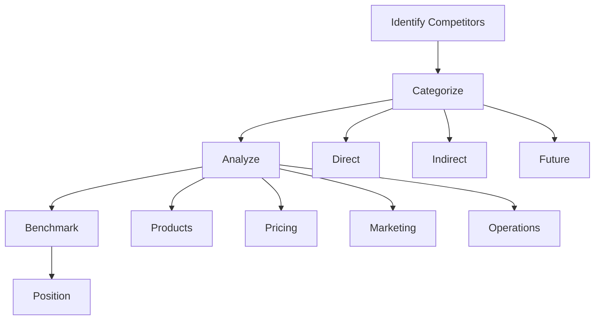

# Chapter 13: Business Strategy & Analysis

**Last Updated:** February 5, 2026

---

## Overview

Strategic thinking and business analysis are essential for making informed decisions. This chapter covers skills for competitive analysis, market research, business modeling, and strategic planning.

### Skills Covered in This Chapter

| Skill | Source | Purpose |
|-------|--------|---------|
| `business-strategist` | coreyhaines31/marketingskills | Strategic planning |
| `competitive-analyst` | coreyhaines31/marketingskills | Competitor analysis |
| `market-researcher` | Unknown | Market analysis |
| `business-model-expert` | Unknown | Business model design |
| `financial-analyst` | Unknown | Financial analysis |

---

## 13.1 Business Strategy

> **Source**: [coreyhaines31/marketingskills](https://github.com/coreyhaines31/marketingskills)  
> **License**: MIT  
> **Tags**: strategy, planning, business

### Purpose

The `business-strategist` skill provides frameworks for strategic planning and business development.

### Strategic Planning Frameworks

| Framework | Purpose | Key Elements |
|-----------|---------|--------------|
| **SWOT** | Situational analysis | Strengths, Weaknesses, Opportunities, Threats |
| **Porter's 5 Forces** | Industry analysis | Competition, Suppliers, Buyers, Substitutes, New Entrants |
| **PESTLE** | Macro environment | Political, Economic, Social, Technology, Legal, Environmental |
| **Value Chain** | Activity analysis | Primary and Support Activities |
| **Blue Ocean** | Strategy canvas | Value innovation |

### 40 Copy-Paste Prompts

#### Strategic Analysis

```
1. "Use @business-strategist to conduct a SWOT analysis for my SaaS startup"

2. "Apply @business-strategist to analyze Porter's 5 Forces for my industry"

3. "Use @business-strategist to create a PESTLE analysis"

4. "Apply @business-strategist to analyze our value chain"

5. "Use @business-strategist to develop a Blue Ocean strategy"

6. "Apply @business-strategist to create a strategic roadmap"

7. "Use @business-strategist to identify core competencies"

8. "Apply @business-strategist to analyze strategic options"

9. "Use @business-strategist to create a mission and vision statement"

10. "Apply @business-strategist to develop strategic objectives"
```

#### Growth Strategy

```
11. "Use @business-strategist to analyze growth opportunities using Ansoff Matrix"

12. "Apply @business-strategist to develop market expansion strategy"

13. "Use @business-strategist to plan product diversification"

14. "Apply @business-strategist to create a geographic expansion plan"

15. "Use @business-strategist to analyze acquisition targets"

16. "Apply @business-strategist to develop partnership strategy"

17. "Use @business-strategist to plan channel expansion"

18. "Apply @business-strategist to create a vertical integration strategy"

19. "Use @business-strategist to develop platform strategy"

20. "Apply @business-strategist to plan ecosystem development"
```

#### Competitive Strategy

```
21. "Use @business-strategist to develop a cost leadership strategy"

22. "Apply @business-strategist to create a differentiation strategy"

23. "Use @business-strategist to plan a focus/niche strategy"

24. "Apply @business-strategist to analyze competitive positioning"

25. "Use @business-strategist to develop a moat strategy"

26. "Apply @business-strategist to create barriers to entry"

27. "Use @business-strategist to plan competitive response"

28. "Apply @business-strategist to develop network effects strategy"

29. "Use @business-strategist to create a switching cost strategy"

30. "Apply @business-strategist to develop a first-mover strategy"
```

#### Strategic Execution

```
31. "Use @business-strategist to create an OKR framework"

32. "Apply @business-strategist to develop a balanced scorecard"

33. "Use @business-strategist to plan strategic initiatives"

34. "Apply @business-strategist to create a strategy cascade"

35. "Use @business-strategist to develop KPIs for strategy"

36. "Apply @business-strategist to plan resource allocation"

37. "Use @business-strategist to create a governance framework"

38. "Apply @business-strategist to develop a change management plan"

39. "Use @business-strategist to plan strategic communication"

40. "Apply @business-strategist to create a strategy review process"
```

---

## 13.2 Competitive Analysis

> **Source**: [coreyhaines31/marketingskills](https://github.com/coreyhaines31/marketingskills)  
> **License**: MIT  
> **Tags**: competitive, analysis, research

### Purpose

The `competitive-analyst` skill helps analyze competitors and market positioning.

### Competitive Analysis Framework



### 30 Copy-Paste Prompts

#### Competitor Identification

```
41. "Use @competitive-analyst to identify direct competitors"

42. "Apply @competitive-analyst to find indirect competitors"

43. "Use @competitive-analyst to identify potential future competitors"

44. "Apply @competitive-analyst to map the competitive landscape"

45. "Use @competitive-analyst to categorize competitor tiers"

46. "Apply @competitive-analyst to identify substitute products"

47. "Use @competitive-analyst to analyze market share distribution"

48. "Apply @competitive-analyst to identify emerging players"

49. "Use @competitive-analyst to track new entrants"

50. "Apply @competitive-analyst to monitor competitor movements"
```

#### Competitor Deep Dive

```
51. "Use @competitive-analyst to analyze competitor product features"

52. "Apply @competitive-analyst to decode competitor pricing strategy"

53. "Use @competitive-analyst to analyze competitor marketing"

54. "Apply @competitive-analyst to research competitor tech stack"

55. "Use @competitive-analyst to analyze competitor funding"

56. "Apply @competitive-analyst to research competitor team"

57. "Use @competitive-analyst to analyze competitor reviews"

58. "Apply @competitive-analyst to decode competitor positioning"

59. "Use @competitive-analyst to analyze competitor SEO strategy"

60. "Apply @competitive-analyst to research competitor partnerships"
```

#### Competitive Intelligence

```
61. "Use @competitive-analyst to create a competitor monitoring system"

62. "Apply @competitive-analyst to set up competitive alerts"

63. "Use @competitive-analyst to build a competitive intelligence database"

64. "Apply @competitive-analyst to create competitor battle cards"

65. "Use @competitive-analyst to develop win/loss analysis"

66. "Apply @competitive-analyst to create competitive positioning map"

67. "Use @competitive-analyst to analyze competitive pricing trends"

68. "Apply @competitive-analyst to track competitor feature releases"

69. "Use @competitive-analyst to monitor competitor hiring"

70. "Apply @competitive-analyst to analyze competitor M&A activity"
```

---

## 13.3 Business Model Design

> **Source**: Unknown  
> **Tags**: business-model, canvas, strategy

### Purpose

The `business-model-expert` skill helps design and analyze business models.

### Business Model Canvas

```
┌─────────────────┬─────────────────┬─────────────────┐
│ Key Partners    │ Key Activities  │ Value           │
│                 ├─────────────────┤ Propositions    │
│                 │ Key Resources   │                 │
├─────────────────┼─────────────────┼─────────────────┤
│ Cost Structure  │ Channels        │ Customer        │
│                 ├─────────────────┤ Relationships   │
│                 │ Customer        ├─────────────────┤
│                 │ Segments        │ Revenue Streams │
└─────────────────┴─────────────────┴─────────────────┘
```

### 15 Copy-Paste Prompts

```
71. "Use @business-model-expert to create a Business Model Canvas"

72. "Apply @business-model-expert to analyze revenue streams"

73. "Use @business-model-expert to design a subscription model"

74. "Apply @business-model-expert to create a freemium strategy"

75. "Use @business-model-expert to design a marketplace model"

76. "Apply @business-model-expert to analyze value propositions"

77. "Use @business-model-expert to design platform business model"

78. "Apply @business-model-expert to create a licensing model"

79. "Use @business-model-expert to analyze customer segments"

80. "Apply @business-model-expert to design channel strategy"

81. "Use @business-model-expert to create a razor-razorblade model"

82. "Apply @business-model-expert to design an affiliate model"

83. "Use @business-model-expert to analyze cost structure"

84. "Apply @business-model-expert to create unit economics model"

85. "Use @business-model-expert to design a franchise model"
```

---

## 13.4 Financial Analysis

> **Source**: Unknown  
> **Tags**: finance, analysis, metrics

### Purpose

The `financial-analyst` skill helps analyze financial performance and projections.

### Key Financial Metrics

| Metric | Formula | Purpose |
|--------|---------|---------|
| **Gross Margin** | (Revenue - COGS) / Revenue | Product profitability |
| **CAC** | Marketing Spend / New Customers | Acquisition efficiency |
| **LTV** | ARPU × Customer Lifetime | Customer value |
| **LTV:CAC** | LTV / CAC | Unit economics health |
| **Burn Rate** | Monthly operating expenses | Runway calculation |
| **MRR** | Monthly recurring revenue | Subscription health |

### 15 Copy-Paste Prompts

```
86. "Use @financial-analyst to calculate unit economics"

87. "Apply @financial-analyst to create a financial projection model"

88. "Use @financial-analyst to analyze cash flow"

89. "Apply @financial-analyst to calculate customer lifetime value"

90. "Use @financial-analyst to analyze profitability by segment"

91. "Apply @financial-analyst to create a pricing sensitivity analysis"

92. "Use @financial-analyst to analyze revenue cohorts"

93. "Apply @financial-analyst to calculate breakeven point"

94. "Use @financial-analyst to create a funding runway model"

95. "Apply @financial-analyst to analyze margin optimization"

96. "Use @financial-analyst to create a scenario planning model"

97. "Apply @financial-analyst to analyze working capital"

98. "Use @financial-analyst to calculate ROI on initiatives"

99. "Apply @financial-analyst to analyze churn impact"

100. "Use @financial-analyst to create a valuation model"
```

---

## Strategic Templates

### SWOT Analysis Template

```markdown
## SWOT Analysis: [Company Name]

### Strengths (Internal, Positive)
- Strong brand recognition
- Proprietary technology
- Experienced team
- Low customer acquisition cost

### Weaknesses (Internal, Negative)
- Limited market reach
- High burn rate
- Single revenue stream
- Technical debt

### Opportunities (External, Positive)
- Growing market
- Regulatory changes favorable
- Competitor weakness
- New technology enablers

### Threats (External, Negative)
- New entrants
- Economic downturn
- Changing customer preferences
- Technology disruption
```

### Competitive Battle Card Template

```markdown
## [Competitor Name] Battle Card

### Overview
- Founded: [Year]
- Funding: [Amount]
- Employees: [Count]
- Target Market: [Description]

### Their Strengths
1. [Strength 1]
2. [Strength 2]

### Their Weaknesses
1. [Weakness 1]
2. [Weakness 2]

### Our Advantages
| Feature | Us | Them |
|---------|----|----|
| Pricing | $X | $Y |
| Feature A | ✅ | ❌ |
| Feature B | ✅ | ✅ |

### Common Objections
- "They're cheaper" → Response: [...]
- "They have more features" → Response: [...]

### Win Stories
- [Customer X chose us because...]
```

---

## Best Practices

### 1. Strategy Development

- Start with customer insights
- Validate assumptions quickly
- Build flexibility into plans
- Review and adapt regularly

### 2. Competitive Intelligence

- Monitor continuously, not periodically
- Focus on actionable insights
- Verify through multiple sources
- Share across teams

### 3. Financial Discipline

- Track leading indicators
- Scenario plan for uncertainty
- Understand unit economics deeply
- Align metrics with strategy

---

## Reflection Points for Chapter 13

1. **How often do you review your strategy?**
   - Annual? Quarterly?
   - Trigger-based reviews?

2. **How do you gather competitive intelligence?**
   - Systematic process?
   - Cross-functional input?

3. **What's your financial visibility?**
   - Real-time dashboards?
   - Forecast accuracy?

4. **How do you communicate strategy?**
   - Team alignment?
   - External communications?

---

## Summary

This chapter covered business strategy and analysis skills:

- **@business-strategist**: Strategic planning and frameworks
- **@competitive-analyst**: Competitor research and positioning
- **@business-model-expert**: Business model design
- **@financial-analyst**: Financial analysis and projections

**Key Takeaway**: Effective strategy requires a combination of external analysis, internal assessment, and continuous adaptation. Use frameworks to structure thinking but stay flexible in execution.

---

**Next Chapter**: [Chapter 14: Social Media & Community →](chapter-14-social-media.md)
